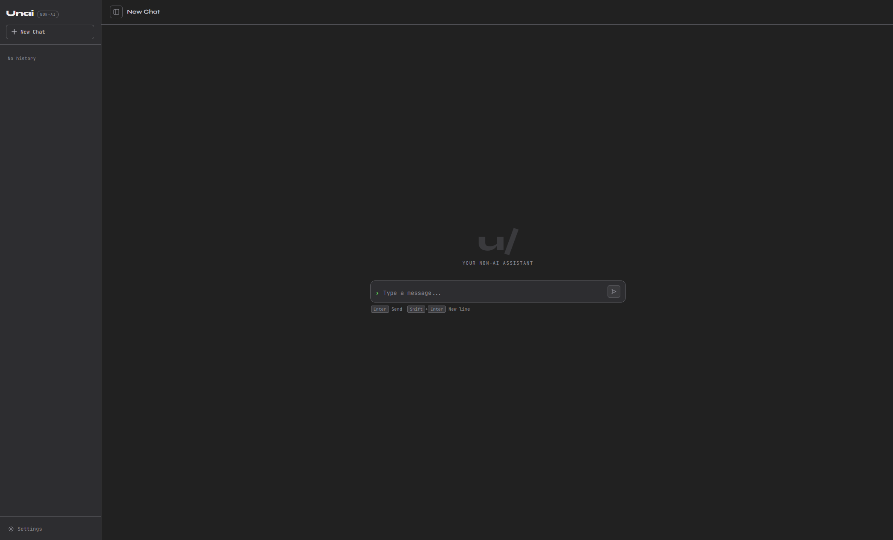

# u/ Unai

> **"un-AI"** — A community-built assistant that runs on lightweight algorithms instead of LLMs.

Unai looks and feels like a modern AI chat service, but nothing inside it is an AI. Every response comes from a small, purpose-built **Skill** — a plain Python module that does one thing well. No GPUs, no API keys, no cloud calls (unless a Skill explicitly needs them).

---

## Why

| | LLM assistant | Unai |
|---|---|---|
| Response time | Seconds ~ Minutes | Milliseconds |
| Power draw | High (GPU) | Near zero |
| Cost per query | API usage fee | Free |
| Scope | Everything (often hallucinated) | Limited, but honest |
| Transparency | Black box | Every line of code is readable |

When Unai can't answer something, it says so clearly. That honesty is a feature, not a bug.

---

## Screenshot



---

## Quick Start

**Requirements:** Python 3.10+, pip

```bash
git clone https://github.com/your-username/unai.git
cd unai
pip install -r requirements.txt
python app.py
```

Open `http://localhost:5000` in your browser.

---

## How It Works

```
User input
    ↓
Each Skill's match() is called in priority order (priority.json)
    ↓  First Skill that returns True wins
respond() generates the reply
    ↓
Token count · elapsed time · t/s are shown alongside the response
```

Skills are tried in the order defined in `priority.json`. The first one whose `match()` returns `True` handles the request.

---

## Project Structure

```
unai/
├── app.py              # Flask web server
├── unai_core.py        # Core logic
├── priority.json       # Skill priority order and enabled/disabled state
├── sessions.db         # SQLite chat history
├── settings.json       # App settings (auto-generated)
├── templates/
│   ├── index.html      # Chat UI
│   └── skills.html     # Skill management page
├── static/
│   ├── app.js          # Frontend logic
│   └── styles.css      # Styles
└── skills/
    ├── calc/
    ├── greeting/
    ├── joke/
    ├── wikipedia/
    └── ddgs/
```

---

## Built-in Skills

| Skill | What it does | External requests |
|---|---|---|
| `greeting` | Greetings and small talk (rule-based + Levenshtein distance) | None |
| `calc` | Arithmetic and algebra with step-by-step output (uses sympy) | None |
| `wikipedia` | Fetches Wikipedia summaries | `en.wikipedia.org` |
| `joke` | Returns a random joke | None |
| `ddgs` | Web search via DuckDuckGo | `duckduckgo.com` |

---

## Web UI Features

- **Chat interface** — clean, minimal, keyboard-driven
- **Branching history** — regenerate any response or edit any message; all variants are saved and browsable with `< 1/2 >` navigation
- **Skill stats** — every response shows `[skill]  N tok · Xms · Y t/s`
- **Skills page** (`/skills`) — reorder by drag & drop, toggle on/off, export as ZIP, import from ZIP, delete

---

## Writing a Skill

Create a folder under `skills/` with two required files:

```
skills/
└── my_skill/
    ├── skill.py
    ├── help.txt
    ├── requirements.txt
    └── meta.json
```

**`skill.py`** — implement exactly two functions:

```python
def match(text: str) -> bool:
    """Return True if this Skill should handle the input."""
    return "hello" in text.lower()

def respond(text: str) -> str:
    """Return the response string."""
    return "Hi there!"
```

**`meta.json`** — Skill metadata:

```json
{
  "name":        "My Skill",
  "description": "What this Skill does",
  "author":      "your-name",
  "version":     "1.0.0"
}
```

That's it. Drop the folder into `skills/`, restart the server, and the Skill appears in the UI automatically.

### Optional files

| File | Purpose |
|---|---|
| `help.txt` | Help text shown by `/help my_skill` |
| `request_urls.txt` | One URL per line — every external host the Skill contacts |
| `requirements.txt` | Standard pip requirements file — installed automatically on import |

### Skill rules

| Rule | Limit |
|---|---|
| Allowed libraries | Python standard library + packages listed in `requirements.txt` |
| Folder size | ≤ 500 MB |
| External requests | Only to URLs declared in `request_urls.txt` |
| Embedded AI models | ≤ 0.5 M parameters |

`request_urls.txt` is a transparency contract: users can always see exactly where a Skill phones home.

---

## Skill Management

Skills can be managed from the **Skills page** (`/skills`) or via the API:

```bash
# Export a skill as a ZIP
GET /api/skills/<id>/export

# Install or update a skill from a ZIP
POST /api/skills/import   (multipart, field: file)

# Delete a skill permanently
DELETE /api/skills/<id>

# Toggle enabled/disabled
POST /api/skills/toggle   { "id": "calc" }

# Update priority order
POST /api/skills/reorder  { "order": ["greeting", "calc", "joke"] }
```

---

## API Reference

| Method | Path | Description |
|---|---|---|
| `GET` | `/` | Chat UI |
| `GET` | `/skills` | Skill management page |
| `POST` | `/api/chat` | `{ message, session_id }` → response + stats |
| `POST` | `/api/chat/sse` | Same as above, but streamed as Server-Sent Events |
| `POST` | `/api/chat/regenerate` | Re-run the bot on a given turn → new branch |
| `POST` | `/api/chat/edit` | Edit a user message → new branch, truncates later turns |
| `POST` | `/api/chat/switch_branch` | Switch the visible branch of a turn |
| `GET` | `/api/sessions` | List all sessions |
| `POST` | `/api/sessions` | Create a session |
| `GET` | `/api/sessions/<id>` | Get session with active-path turns |
| `DELETE` | `/api/sessions/<id>` | Delete a session |
| `POST` | `/api/sessions/<id>/rename` | Rename a session |
| `GET` | `/api/skills` | List skills in priority order |
| `GET` | `/api/skills/<id>/export` | Download skill as `.zip` |
| `POST` | `/api/skills/import` | Upload and install a skill ZIP |
| `DELETE` | `/api/skills/<id>` | Delete a skill from disk |
| `POST` | `/api/skills/toggle` | Enable or disable a skill |
| `POST` | `/api/skills/reorder` | Update skill priority order |
| `GET` | `/api/settings` | Get app settings |
| `POST` | `/api/settings` | Update app settings |

---

## Configuration

**`priority.json`** — managed automatically by the UI, but editable by hand:

```json
{
  "order":    ["greeting", "calc", "wikipedia", "joke", "ddgs"],
  "disabled": []
}
```

**`settings.json`** — auto-generated on first run:

```json
{
  "preload_skills": true
}
```

`preload_skills: true` loads all enabled Skills into memory at startup, eliminating the cold-start delay on the first query.

---

## Contributing

Skills are the primary contribution surface. If you've built something useful:

1. Make sure `meta.json` is filled out accurately
2. List every external host in `request_urls.txt`
3. Keep `skill.py` readable — it's the whole point
4. Open a pull request

Bug reports and ideas are welcome as issues.

---

## License

MIT
