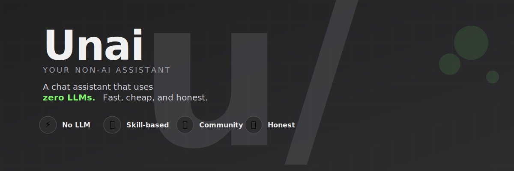

<p align="center">
  <a href="LICENSE"></a>
  
  
</p>

Unai is a chat application that builds responses from Python **Skills** instead of using an LLM.

When a message arrives, Unai tries each Skill in order (defined by `priority.json`), calls the first Skill whose `match()` returns `True`, and then runs that Skill's `respond()` function. If nothing matches, Unai returns a fixed fallback message.

## Table of Contents

- [Features](#features)
- [Demo](#demo)
- [Quick Start](#quick-start)
- [Installation](#installation)
- [How It Works](#how-it-works)
- [Built-in Skills](#built-in-skills)
- [Writing a Skill](#writing-a-skill)
- [API Reference](#api-reference)
- [Configuration](#configuration)
- [Development](#development)
- [License](#license)

## Features

- 🔧 **Skill-based response routing** - Modular Python Skills handle different query types
- 💬 **Flask-based web chat UI** - Clean, responsive interface
- 🗄️ **SQLite-backed session storage** - Persistent conversation history
- 🌳 **Branching conversation history**
  - Regenerate a turn to add a new branch
  - Edit a user message to truncate later turns and create a new branch
  - Switch between branches
- ⚡ **Real-time progress** - SSE-based progress updates while Skills are being selected
- 🎯 **Early response selection** - Select responses as soon as they're ready
- 📊 **Response metadata** - Token count, elapsed time, and tokens/sec
- 🔌 **Skills management** - Reorder, enable/disable, import/export Skills as ZIP files
- ⌨️ **Slash commands** - `/help` and `/help <skill>` for quick assistance

## Demo


## Quick Start

**Windows (recommended):**
```bat
git clone https://github.com/PixelNest256/Unai.git
cd Unai
start.bat
```

**macOS / Linux:**
```bash
git clone https://github.com/PixelNest256/Unai.git
cd Unai
python -m venv .venv
source .venv/bin/activate
pip install -r requirements.txt
python app.py
```

Then open `http://localhost:5000` in your browser.

## Installation

### Requirements

- Python 3.10 or newer
- `pip`

### Windows

#### Option 1: Automated (Recommended)

```bat
git clone https://github.com/PixelNest256/Unai.git
cd unai
start.bat
```

`start.bat` creates the virtual environment (if needed), installs dependencies, and starts the app in one step. It automatically detects pyenv Python 3.12.0 or falls back to the system Python.

#### Option 2: Manual Setup

```bash
git clone https://github.com/PixelNest256/Unai.git
cd unai
python -m venv .venv
```

Activate the virtual environment:

```powershell
# PowerShell
.\.venv\Scripts\Activate.ps1
```

```bat
:: Command Prompt
.venv\Scripts\activate.bat
```

Install dependencies and start:

```bash
pip install -r requirements.txt
python app.py
```

### macOS / Linux

```bash
git clone https://github.com/PixelNest256/Unai.git
cd unai
python -m venv .venv
source .venv/bin/activate
pip install -r requirements.txt
python app.py
```

## How It Works

Unai's processing flow is straightforward:

1. Check whether the input is a slash command
2. Try each Skill in `skills/priority.json` order
3. Call `respond()` on the first Skill whose `match()` returns `True`
4. Normalize the response into a shared result format and return it to the UI

In the web UI, `/api/chat/sse` streams Skill-selection progress so the frontend can show `matching` and `responding` states. The response text can be animated token by token on the client side.

### Directory Structure

```text
unai/
├── app.py              # Flask web server
├── unai_core.py        # Core processing logic
├── requirements.txt    # Python dependencies
├── sessions.db         # SQLite database (auto-created)
├── settings.json       # App settings (auto-created)
├── static/             # CSS, JavaScript, assets
├── templates/          # HTML templates
└── skills/             # Skill modules
    ├── priority.json   # Skill execution order
    ├── greeting/       # Built-in skills...
    ├── calc/
    ├── ddgs/
    └── ...
```

## Built-in Skills

| Skill | Purpose | Implementation |
|-------|---------|----------------|
| `greeting` | Greetings and small talk | Rule-based matching with Levenshtein distance |
| `calc` | Mathematical calculations | Safe AST-based evaluation; uses SymPy for `expand`, `factor`, `solve` |
| `wikipedia` | Wikipedia summaries | Uses English Wikipedia summary API |
| `ddgs` | Search summaries | Summarizes the first DuckDuckGo search result |
| `ddgs_chatbot` | Conversational search | Interactive chat-based search with DuckDuckGo |
| `joke` | Random jokes | Returns a random joke from a predefined list |
| `valves_test` | Development sample | Displays saved `valves` values for Skill |

### Skills Management

The `/skills` page supports:

- 🔍 Searching Skills
- ↔️ Drag-and-drop reordering
- ✅ Enabling and disabling Skills
- 📥 Importing Skills from ZIP files
- 📤 Exporting Skills to ZIP files
- 🗑️ Deleting Skills
- ⚙️ Editing per-Skill `valves`
- ❓ Viewing `help.txt`

**ZIP import format:** The ZIP file must contain exactly one top-level folder with at least `skill.py` and `meta.json`. If `requirements.txt` is present, Unai runs `pip install -r` during import.

## Writing a Skill

Add a new Skill under `skills/<skill_id>/`.

### Required Files

```text
skills/
└── my_skill/
    ├── skill.py       # Main implementation
    └── meta.json      # Metadata
```

### Optional Files

| File | Purpose |
|------|---------|
| `help.txt` | Help text shown by `/help <skill>` |
| `requirements.txt` | Python dependencies for the Skill |
| `valves.json` | Saved settings written from the UI |

### `skill.py`

Implement these two functions:

```python
def match(text: str) -> bool:
    return "hello" in text.lower()

def respond(text: str) -> str | None:
    return "Hi there!"
```

- `match()` decides whether the Skill should handle the input
- `respond()` returns the response text
- If `respond()` returns `None`, the Skill is skipped

### `meta.json`

```json
{
  "name": "My Skill",
  "description": "What this Skill does",
  "author": "your-name",
  "version": "1.0.0"
}
```

Add `valves` for editable settings in the Skills page:

```json
{
  "name": "My Skill",
  "description": "What this Skill does",
  "author": "your-name",
  "version": "1.0.0",
  "valves": [
    {
      "key": "api_key",
      "label": "API Key",
      "type": "password",
      "description": "Optional setting shown in the UI",
      "default": ""
    }
  ]
}
```

**Valves field types:**

| Field | Meaning |
|-------|---------|
| `key` | Storage key |
| `label` | UI label |
| `type` | `text`, `password`, or `number` |
| `description` | Extra help text |
| `default` | Default value |
| `placeholder` | Input placeholder |

## API Reference

### Chat Endpoints

| Method | Path | Description |
|--------|------|-------------|
| `GET` | `/` | Chat UI |
| `POST` | `/api/chat` | Send message. Body: `{ message, session_id }` |
| `POST` | `/api/chat/sse` | Send with SSE progress updates |
| `POST` | `/api/chat/commit` | Commit selected candidate |
| `POST` | `/api/chat/regenerate` | Regenerate a turn. Body: `{ session_id, turn_id }` |
| `POST` | `/api/chat/edit` | Edit message and resend. Body: `{ session_id, turn_id, message }` |
| `POST` | `/api/chat/switch_branch` | Switch branch. Body: `{ session_id, turn_id, branch_index }` |

### Session Endpoints

| Method | Path | Description |
|--------|------|-------------|
| `GET` | `/api/sessions` | List sessions |
| `POST` | `/api/sessions` | Create session |
| `GET` | `/api/sessions/<id>` | Get session |
| `DELETE` | `/api/sessions/<id>` | Delete session |
| `POST` | `/api/sessions/<id>/rename` | Rename session |

### Skill Endpoints

| Method | Path | Description |
|--------|------|-------------|
| `GET` | `/skills` | Skills management page |
| `GET` | `/api/skills` | List Skills |
| `GET` | `/api/skills/<id>/export` | Export Skill as ZIP |
| `POST` | `/api/skills/import` | Import Skill ZIP |
| `DELETE` | `/api/skills/<id>` | Delete Skill |
| `POST` | `/api/skills/toggle` | Enable/disable Skill |
| `POST` | `/api/skills/reorder` | Update Skill order |
| `GET` | `/api/skills/<id>/help` | Fetch `help.txt` |
| `GET` | `/api/skills/<id>/valves` | Fetch valves definitions/values |
| `POST` | `/api/skills/<id>/valves` | Update valves values |

### Settings Endpoints

| Method | Path | Description |
|--------|------|-------------|
| `GET` | `/api/settings` | Get app settings |
| `POST` | `/api/settings` | Update app settings |

### Slash Commands

- `/help` - Shows list of enabled Skills and summaries
- `/help <skill_id>` - Shows the target Skill's `help.txt`

## Configuration

### `skills/priority.json`

Stores Skill execution order and disabled Skills:

```json
{
  "order": ["greeting", "wikipedia", "ddgs", "ddgs_chatbot", "calc", "joke"],
  "disabled": []
}
```

### `settings.json`

Stores app-wide settings:

```json
{
  "preload_skills": true
}
```

When `preload_skills` is `true`, Unai loads all enabled Skills at startup to reduce the delay before the first response.

## Development

### Tech Stack

- **Backend:** Flask, Python 3.10+
- **Database:** SQLite (sessions, conversation history)
- **Frontend:** Vanilla JavaScript, Server-Sent Events (SSE)
- **Architecture:** Modular Skill-based routing

### Development Notes

- `sessions.db` is SQLite (auto-created)
- `priority.json` is updated from the Skills page
- A Skill works even without `help.txt`
- If `requirements.txt` is present during ZIP import, Unai installs its dependencies
- The current implementation does not enforce external-host restrictions via `request_urls.txt`

## License

MIT © [PixelNest256](https://github.com/PixelNest256)
